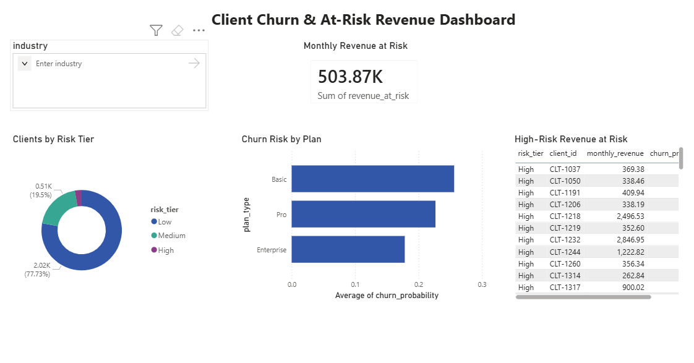

# Client Churn & At-Risk Revenue Analysis

Predicts which B2B clients are likely to churn and quantifies the monthly revenue at risk, so a Client Success team can prioritise retention outreach.

## Problem
Ops teams often find out a client is leaving *after* they've gone. This project scores every active client on churn risk and surfaces the accounts (and dollars) most worth saving.

## Data
2,600 clients with onboarding, engagement, payment, and satisfaction attributes. *(Synthetic dataset generated to mirror a real client-health schema — no real client data is used.)*

## Approach
1. **Clean** : fixed inconsistent plan labels, imputed missing NPS / login values.
2. **Explore** : churn rate by plan; late-payment and inactivity patterns.
3. **Model** : Logistic Regression (chosen for interpretability over raw accuracy), standardised features, 75/25 train-test split.
4. **Score** : every client gets a churn probability, a risk tier (Low/Med/High), and a revenue-at-risk figure that feeds a Power BI dashboard.

## Results
- **ROC AUC: 0.75**
- Top churn drivers: days since last login, low weekly engagement, late payments.
- Identified **72 high-risk clients** representing **~$110K monthly revenue at risk** (of ~$500K across all tiers).

## Tech Stack
Python (Pandas, NumPy, scikit-learn), Power BI.

## Files
- `churn_analysis.py` — cleaning, EDA, modelling, and client scoring
- `clients_raw.csv` — input dataset
- `clients_scored.csv` — model output (Power BI source)
- `dashboard.png` — Power BI dashboard screenshot
